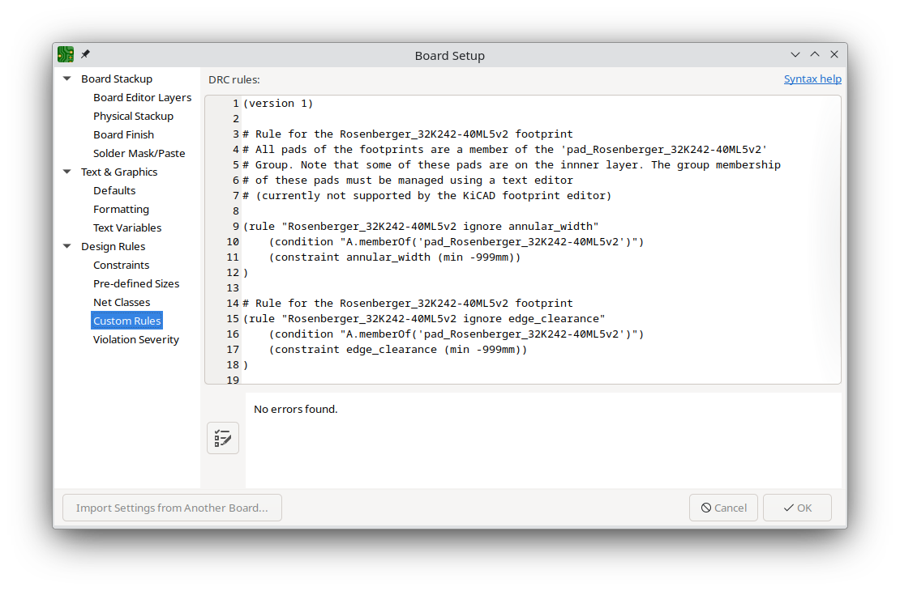
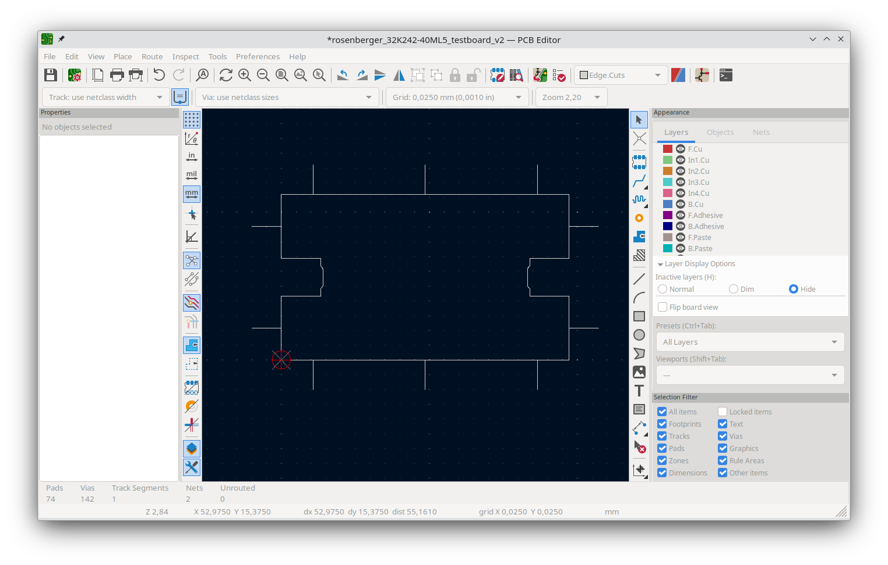

# How to Use the Rosenberger32K242-40ML5 KiCAD Footprint

## Version History
 - 15.11.2023 - Update milling contours to support the AISLER 1.8mm outline tool diameter update.  
 - 16.08.2023 - Updated RF structure
 - 05.05.2023 - Initial: Rosenberger_32K242-40ML5v1.kicad_mod

## Current Status
 - Unferified (changes were made to the design but there was no fabrication run)
## Requirements
- Tested with KiCAD 7.0
- Compatible with the  [AISLER 6LayerHD](https://community.aisler.net/t/6-layer-hd-pcb-stackup/1703)
 stakup only. NO other layer stack will work

## Installation Instructions

1. Save the footprint folder to a location of your choice
2. Add the "RF_Connectors.pretty" folder to your KiCAD footprint library (Footprint Editor -> Manage Footprint Libraries)
3. Make sure that the STEP file "Rosenberger_32K242-40ML5.step" is in the same folder as the *.kicad_mod file
4. Done

## How to use it on a PCB

1. Assign the footprint to a suitable schematic symbol of your choice
2. In the layout make sure to have the footprint covered by GND plane (Copper Zone) on every layer
3. Add custom design rule for the connector type to avoid DRC errors:

   ```
   PCB-Editor -> File -> Board Setup -> Design Rules -> Custom Rules
   ```

   ```
   (version 1)

   # Rule for the Rosenberger_32K242-40ML5v2 footprint
   # All pads of the footprints are a member of the 'pad_Rosenberger_32K242-40ML5v2'
   # Group. Note that some of these pads are on the innner layer. The group membership
   # of these pads must be managed using a text editor
   # (currently not supported by the KiCAD footprint editor)

   (rule "Rosenberger_32K242-40ML5v2 ignore annular_width"
      (condition "A.memberOf('pad_Rosenberger_32K242-40ML5v2')")
      (constraint annular_width (min -999mm))
   )

   # Rule for the Rosenberger_32K242-40ML5v2 footprint
   (rule "Rosenberger_32K242-40ML5v2 ignore edge_clearance"
      (condition "A.memberOf('pad_Rosenberger_32K242-40ML5v2')")
      (constraint edge_clearance (min -999mm))
   )
   `````




4. The footprint makes use of castelleted holes/slots to create a short piece of edge plating. Therefore the [AISLER design rules](https://community.aisler.net/t/castellated-holes/48) for castellated holes apply. This means that you have to define [custom bridges and frames](https://community.aisler.net/t/custom-bridges-and-frames/49).




## Order the board

There will be some warings when ordering the board at AISLER. This is to be expected due to the careful placement of the castellated slots to create an edge plating. 

The following warnings are normal:


