# An Open Source Multilayer SMA Coaxial to Microstrip Transition

Recently I came across [openEMS](https://www.openems.de/), a free and open electromagnetic field solver using the FDTD method.

The project has been around a few years, and it is quite impressive how far it has developed (05/2023). I was wondering if it is possible to solve a complex RF simulation task using open source software only.

A license of a typical commercial RF simulation environment (CST, ADS, AWR...) can cost $1000/month easily. This price is out of range for hobbyists and small companies that do not use these software products on a daily basis.

I chose the task below as a representative test case:
> "Design a high performance SMA (SubMiniature version A) low cost Coaxial to Microstrip transition up to 20GHz on a FR4 multilayer stackup fabricated by an affordable PCB prototyping service."

Simulation tasks of this kind must be solved in the RF industry frequently because the transition needs to be designed for each specific layer stack with its own characteristic substrate materials, thicknesses and metal layers.

A list of open source software used in this project:
- [OpenEMS](https://www.openems.de/)
- [FreeCAD](https://www.freecad.org/)
- [GNU Octave](https://octave.org/)
- [KiCAD](https://www.kicad.org/)
- [ParaView](https://www.paraview.org/)
- [QUCS](https://qucs.sourceforge.net/)
- [VS Code](https://code.visualstudio.com/)
- [Inkscape](https://inkscape.org/)
- [IEEE P370 Standard](https://opensource.ieee.org/elec-char/ieee-370)

## 1. Table of Contents

- [1. Table of Contents](#1-table-of-contents)
- [2. Rosenberger 32K242-40ML5 SMA Connector](#2-rosenberger-32k242-40ml5-sma-connector)
- [3. The Connector Model](#3-the-connector-model)
- [4. PCB Design Considerations and Manufacturing](#4-pcb-design-considerations-and-manufacturing)
- [5. Simulation Workflow](#5-simulation-workflow)
- [6. Simulation Results](#6-simulation-results)
- [7. Measurement Results](#7-measurement-results)
- [8. Conclusion](#8-conclusion)

## 2. Rosenberger 32K242-40ML5 SMA Connector
I have chosen a typical right angle jack SMA connector. This connector type requires a cutout in the PCB edge which is an additional design and manufacturing effort.

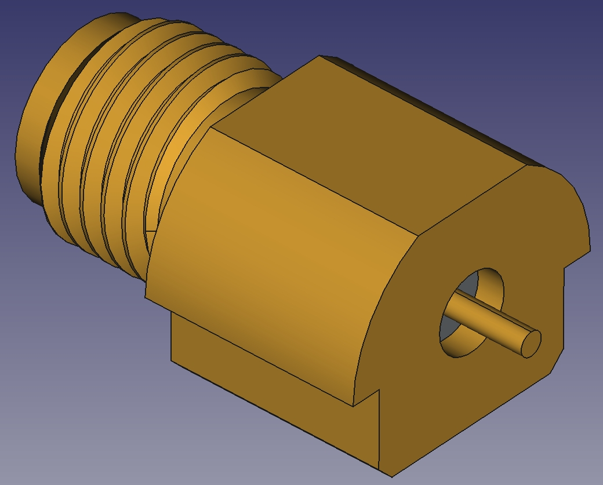

Figure 1: A typical edge mount SMA connector to be mounted in a cutout

However, I like these connectors because the solder mount is very strong due to the large mounting area which results in very good mechanical durability. The parasitic inductance in the return current is also low because the solder joint is right at the circular edge of the coaxial outer conductor.

 Connectors of this kind are available from multiple manufacturers (Molex, Würth, Rosenberger...). I chose the one which was cheapest for me to source which was the one manufactured by Rosenberger. Therefore the 32K242-40ML5 made the run, purchased for about 6€ at rs-online.com. Figure 1 shows an exemplary CAD model of the Würth 60312202114307 (Rosenberger does not provide CAD a model for their part).

## 3. The Connector Model
Typically the first step in designing a coaxial to microstrip transition is to request a simulation or mechanical model from the connector vendor. 

Today, most vendors provide detailed models for commercial simulators. However, in most cases a NDA (Non Disclosure Agreement) is required . Sometimes the internals of the connector are even encrypted and therefore not visible to the user (e.g. SV Microwave).

I had no hope that Rosenberger would send a model to me - a private person without a NDA. I tried it nevertheless - with no success. They did not even bother to respond to my email.

So, in order to proceed the connector was cut in half with a rotary tool. The goal was to create a "poor man´s microsection view". I was quite surprised how well this tuned out. The result is good enough to take some measurements.

Ready to create a 3D model in FreeCAD!

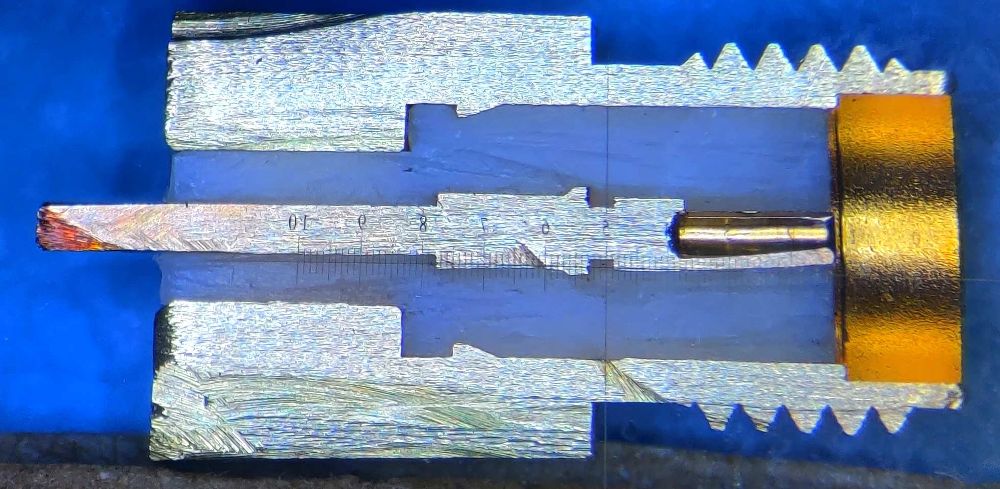

Figure 2: Microsection view of the Rosenberger 32K242-40ML5

To estimate the substrate permittivity we can use the measured dimensions and the standard equation for the impedance of a coaxial waveguide. We know that the impedance inside of the connector must match $Z_0$=50Ohm at inner conductor clamping area on the right side of Figure 2. 

$$
    Z_0 = \frac{1}{2\pi}\sqrt{\frac{\mu_0\mu_r}{\epsilon_0\epsilon_r}}\ln\left(\frac{D}{d}\right)
$$

The relative permittivity of the connector substrate is found to be around $\epsilon_r$=2.08 for measured diameter values of D=4mm (outer), d=1.2mm (inner) and $\mu_r$=1,  $Z_0$=50Ohm. This is a typical value for a teflon material.

## 4. PCB Design Considerations and Manufacturing
For a project of this kind choosing the right PCB (Printed Circuit Board) stackup and technology is actually more important than the choice of the SMA connector.

To prevent radiation effects at the interconnect, to minimize GND return current inductance and also for mechanical durability reasons it is usually beneficial to have an edge metallization in the area around the connector. However, this technology typically involves an additional PCB fabrication step which increases the cost significantly (which is especially true for common PCB prototyping platforms). Because this is a hobby project I wanted it to be as cheap as possible.

In the past I have worked with a german PCB prototyping service [AISLER](https://aisler.net/?lang=en). I was quite satisfied with the quality of the delivered boards. Starting from 12/2022 AISLER has released a new FR4 6 Layer PCB stackup that should work well for RF projects for various reasons. One very nice features of AISLER is that "Castellated Holes" are free.

I had the idea to abuse this castellated hole feature to create a short piece of edge metallization. Placing the castellated holes and slots and also to plan the board outline carefully was tricky. I even had to contact the support team of AISLER. The provided support was excellent!

The fabricated result is amazing! The edge metallization looks very good and it comes for free :)

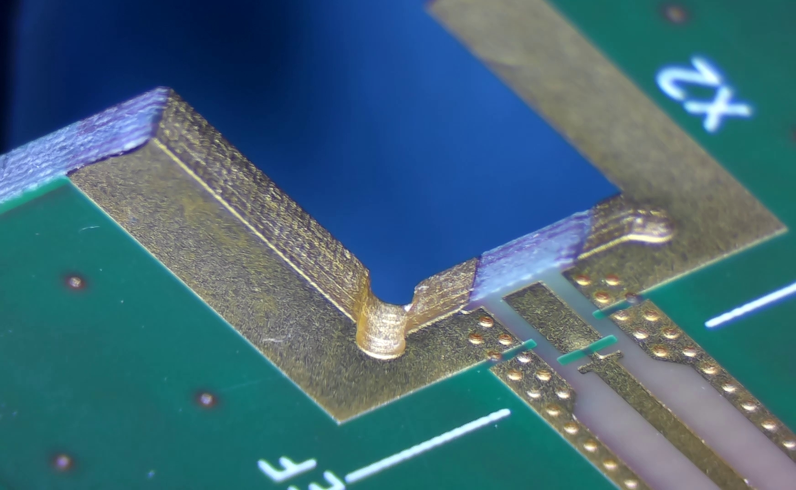

Figure 3: Edge-Metallization of the testboard fabricated by AISLER using castellated slots

## 5. Simulation Workflow

There are two ways in openEMS to create the model required for the simulation. One can either use the octave/python interface to create the shapes that form the model directly in openEMS or to import *.stl mesh files.

I chose to create the entire model in FreeCAD. This has the benefit that all the import/export functions of FreeCAD can be used. One downside is that one might run into some [meshing issues](https://github.com/thliebig/openEMS-Project/discussions/43) if the mesh lines do not exactly hit the imported shapes (floating point accuracy).

The following figure shows the simulation workflow I came up with:

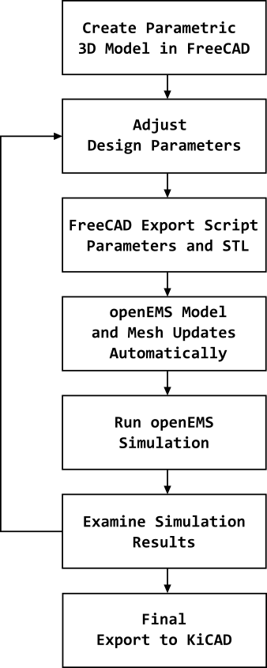

Figure 4: FreeCAD and openEMS Simulation Workflow

This approach is quite powerful. The model dimensions are stored in one place only. So when a dimension is changed in FreeCAD everything updates automatically. From the 3D model all the way to the mesh lines what enables quick and easy tuning of the model. In this way the workflow is almost similar to CST Microwave Studio, a commercial EM-Solver Suite.

Figure 5 shows the connector and PCB model in FreeCAD with a cut plane at y=0. The spreadsheet on the right side shows the parameter list where all dimensions of the model can be adjusted. The PCB core and prepreg materials are hidden.

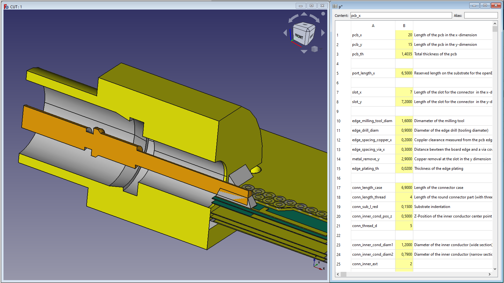

Figure 5: The Connector and PCB Model in FreeCAD

Once the model parameters are settled in FreeCAD the user executes the Python FreeCAD export script which generates a set of *.stl files. These files are then imported in the octave openEMS script. Figure 6 shows the model and mesh result in AppCSXCAD the 3D Model editor/viewer of openEMS. 

Proper meshing techniques were applied in order to get a reasonably fast simulation and high accuracy results. One can clearly see how the mesh is denser in the area where the geometry details have a greater impact and less dense in less important areas.

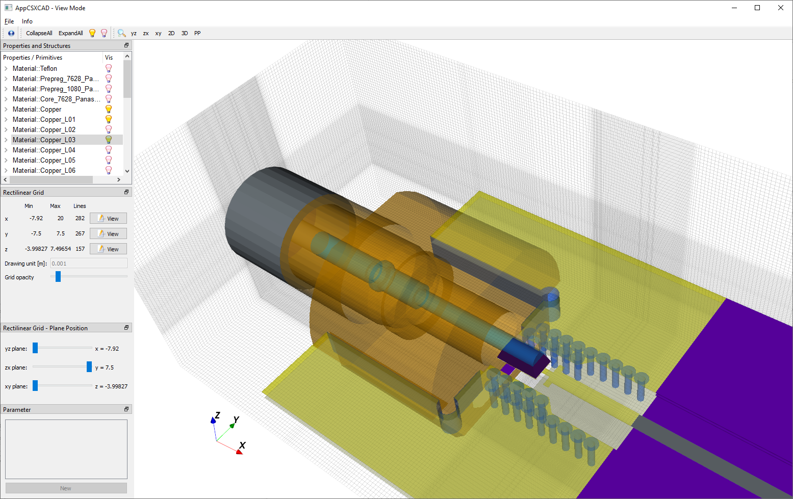

Figure 6: The Connector and PCB Model in AppCSXCAD (openEMS)

The final output of the project - which is hopefully of use for the community - is a multilayer KiCAD footprint for the connector. Officially the KiCAD footprint editor does not support shapes on the internal metal layers. However, the footprint file can be modified with a text editor. Here shapes can be placed on the internal layers which works just fine. 

In order to use the KiCAD connector Footprint simply assign it to a symbol in the schematic and place "Copper Zones" (see example board) on the internal layers of your application board. Make sure to follow the  [bridges and frames](https://community.aisler.net/t/bridges-and-frames/49) design rules from AISLER. Everything else is handled in the KiCAD footprint.

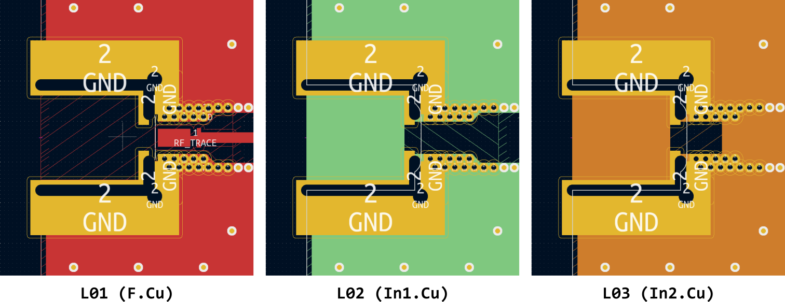

Figure 7: Multi layer Connector Footprint in KiCAD

Finally to test and measure the connector transition a 6 layer back-to-back test board was created in KiCAD. A total of three boards were manufactured by AISLER for around 20€. 

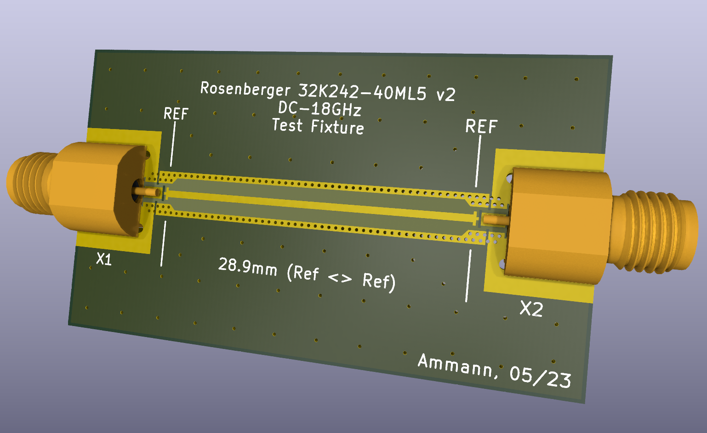

Figure 8: Test Fixture of the Rosenberger 32K242-40ML5 SMA Connector on  the AISLER 6LayerHD Stackup in KiCAD

After the fabrication of the PCB the SMA connectors were hand soldered on the test board as shown in Figure 9. 

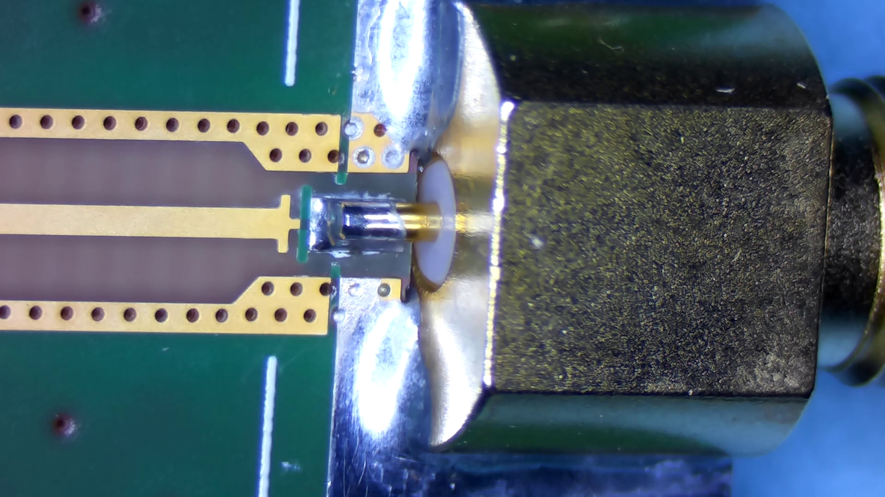

Figure 9: Rosenberger Connector Solder joint

## 6. Simulation Results

OpenEMS writes field data in a format suitable for ParaView. ParaView is a open software to visualize vector fields. Figure 9 shows a E-Field plot at the xz (y=0) plane (20GHz). One can clearly spot the transitions from the coaxial mode Mode (vertical field vectors) to the the microstrip mode. Also the removal of the GND plane right under the connector Pad is noticeable. 

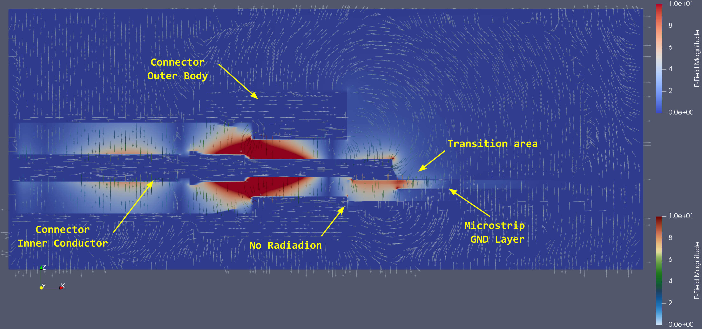

Figure 10: Test Fixture of the Rosenberger 32K242-40ML5 SMA Connector on  the AISLER 6LayerHD Stackup

Above the right end of the inner conductor there is some small radiation visible. The field lines bend from the solder joint up to the top ouf the connector outer body. This undesired effect is given by the connectors construction and can not be avoided.

At the edge where the connector and the PCB meet the internal copper layers of the PCB and the connector outer body form a parasitic parallel plate waveguide along the z dimension. It is important to avoid the excitation of this waveguide to prevent excessive leakage at higher frequencies. The field results clearly show that there is no radiation at the connector to pcb interface.

Finally let´s examine the Scattering Parameters of the simulation. Figure 11 shows the simulation results calculated by openEMS. The reference plane for all S-Paramteter results is located at the right edge of the capacitive compensation structure as shown in Figure 8. The exact location can be verified in the KiCAD PCB file. This edge is the transition where the connector footprint ends and the 50Ohm microstrip line starts. 

Port 1 is the coaxial one, Port 2 the microstrip port. A return loss greater than 23dB was achieved from DC to 20GHz.

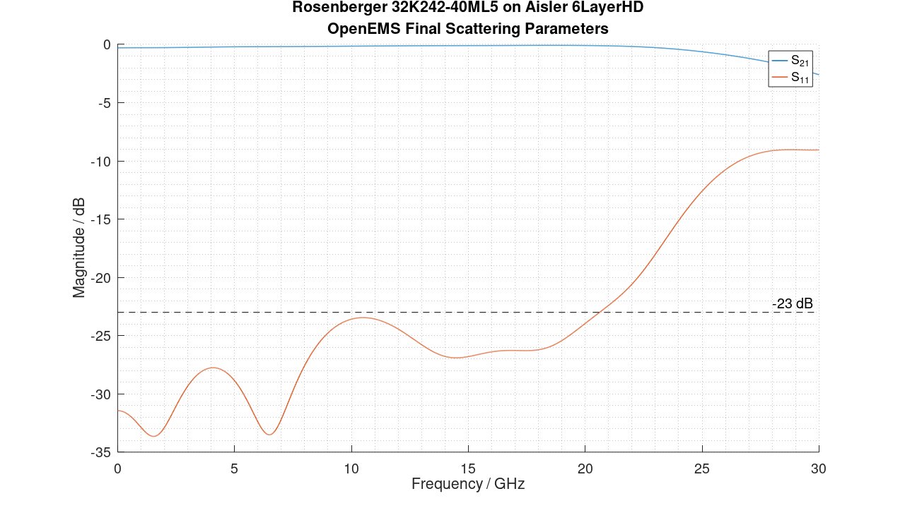

Figure 11: OpenEMS simulation result after optimization. Port 1 (coaxial), Port 2 (microstrip), Return Loss > 23dB

The smit chart plot in Figure 12 shows the in- and output trajectories on the complex reflection coefficient plane. They are nicely point symmetric to the origin. Overall these  results look promising. There is some margin for manufacturing tolerances left.

The openEMS simulation takes about 20 minutes to complete.

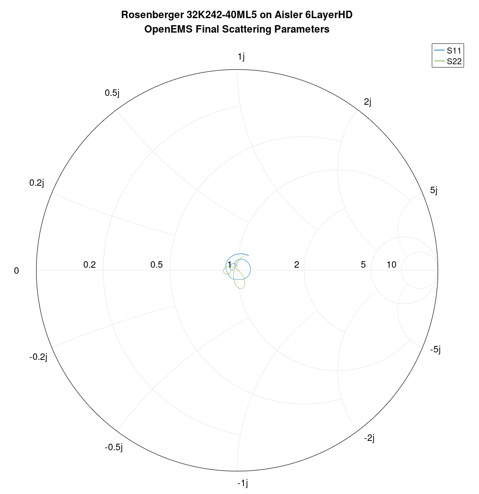

Figure 12: OpenEMS simulation result. In/ Output Matching from DC to 20GHz, Port 1 (coaxial), Port 2 (microstrip)

## 7. Measurement Results

The fabricated test board from Figure 8 with two connectors back to back was measured with a high performance VNA (Vector Network Analyzer). The results are shown in Figure 13.

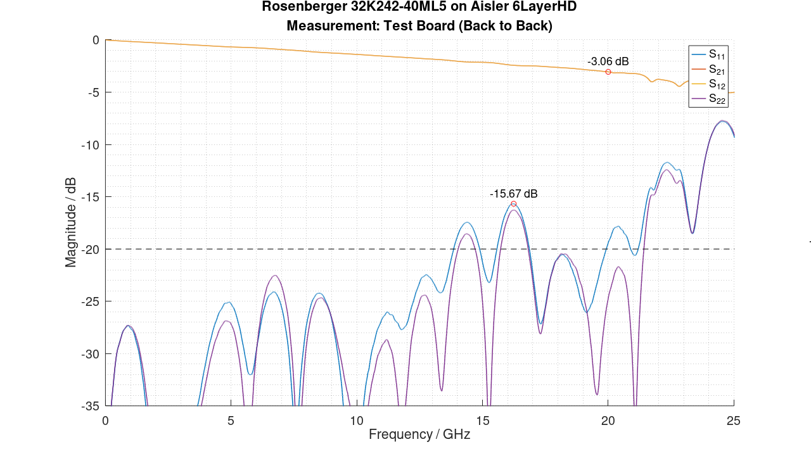

Figure 13: S-Parameter results, Test board Figure 8, two connectors back to back, reference plane at the SMA coax.

Let´s take a closer look at this plot. The S21 curve is almost perfect. It is flat with no dips. However, one will notice that the magnitude return loss curves are not identical. So, the structure is not entirely symmetrical. This is due to manufacturing tolerances. Keep in mind that we are talking about a low cost connector and PCB. The connectors are hand soldered, so some small displacements are to expected.

In order to relate this result of Figure 13 to the simulated one in Figure 11 some some approximate observations can be done. Approximately, we can think about the measured structure as two identical imperfectly matched two ports (the connector) with low insertion loss and an ideal transmission line in between. Because the insertion loss of the two ports is low every miss match on either side will propagate directly through to the other side. The transmission line will further rotate the phase of the reflection coefficients with frequency. The 28.9mm transmission line is multiple wavelengths long at the highest frequency of interest (20GHz). So it is save to assume that the all possible phase angles between the two imperfectly matched connectors will occur over frequency.

This phase related worst case impedance miss match $\Gamma_{max}$ that may occur when two imperfectly matched ports with $|\Gamma_a|$ and $|\Gamma_b|$ are connected can be estimated from the following equation. It can be easily derived from the definition if the reflection coefficient:

$$
    |\Gamma_{max}| = \frac{|\Gamma_a| + |\Gamma_b|}{|\Gamma_a \Gamma_b| + 1}
$$

For this idealized analysis let´s assume identical connectors with $|\Gamma_a|=|\Gamma_b|=|\Gamma|$. From Figure 13 we take $|\Gamma_{max}|$=-15.67dB. Solving the above equation for $|\Gamma|$ gives us an estimation of the connector two-port return loss of:

$$
    |\Gamma| = \frac{1- \sqrt{1-|\Gamma_{max}|^2}}{|\Gamma_{max}|}= -21.63\mathrm{dB}
$$

So we know simply by looking at Figure 13 closely that the achieved measured return loss of the connector is slightly worse than in the simulation.

To properly compare the simulation with the measurement results some advanced mathematical postprocessing must be applied to the data of Figure 13. There are two options: 

1. Perform a S-Parameter simulation using the touchstone files of the EM-simulation to model the back to back structure from Figure 8. In the simulator place the touchstone files back to back with a transmission line of the correct length in between. 
2. Cut the structure mathematically in half to separate the left from the right connector. De-embed the remaining transmission line in a second step.

Method 1. has the benefit of being easy to generate using any standard S-Parameter simulator such as Qucs. The downside of this method is that the characteristics a the single connector (left or right ) are not extracted. However, the single connector characteristics are the one of interest when using the connector in an actual circuit. 

The approach in Method 2 extracts these single connector characteristics. This data can be compared directly to the simulation result which is desireable. However, the output data of this method is more difficult to generate.
The IEEE P370 Standard [(Electrical Characterization of Printed Circuit Board and Related Interconnects at Frequencies up to 50 GHz) ](https://ieeexplore.ieee.org/document/8078138)comes with an open source mathematical algorithm to achieve this goal. The source code can be found on the [IEEE gitlab](https://opensource.ieee.org/elec-char/ieee-370). Internally it uses a time domain transformation approach.

Finally Figure 14 shows the prost processed measurement results from Figure 13 by applying Method 2 on the measured data.

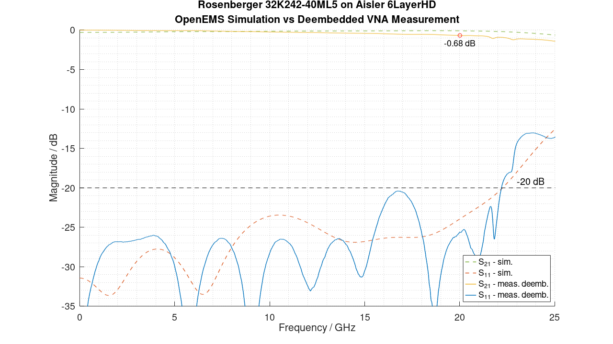

Figure 14: OpenMES Simulated S-Parameters vs. VNA-Measurement (Post-Processed/De-Embedded via Method 2) 

We can see, that the worst case insertion loss around 17.5GHz is very close to our estimated value of -21.63dB which was calculated above. Overall the agreement is impressive considering the large manufacturing tolerances of a PCB fabricated by a prototyping service and a hand soldered connector.

The connector itself has a very large return loss tolerance specification. From the datasheet:
> VSWR = 1.1 + 0.02 x 20GHz = 1.5 (RL = 14dB)

This is much worse than the measured result on its own! So, overall the agreement is remarkable.

## 8. Conclusion

To test the openEMS FDTD-Solver a SMA coaxial to microstrip transition was designed and simulated. 

The Rosenberger 32K242-40ML5 connector has been integrated on a 6 layer test board with FR4 substrate fabricated by AISLER a german PCB prototyping service. Using castellated holes in a suitable configuration a PCB edge metallization has been realized with no additional cost. Finally a easy to use KiCAD footprint was created. The footprint enables the user to design complex RF circuits up to 20GHz on the AISER 6LayerHD FR4 stackup.  

The transition is very low cost and intended for hobbyist and prototyping use. A 20GHz SMA transition for under 20€ as a "one off prototype order" is to my knowledge unique. 

| Item                               | Cost          |
|:-----------------------------------|:--------------|
| 6 Layer PCB by AISLER (one piece)  | 20€/3 = 6.67€ |
| Rosenberger connector (two pieces) | 2*6€ = 12€    |
| Total Cost                         | 18.67€        |

 

 The agreement between simulated and measured results is very good especially considering the high manufacturing tolerances due to hand soldering and a low cost PCB. OpenEMS does a remarkable job here! In my opinion this simulator gets way to less attention for its capabilities. 

 This case study shows that it is possible to design high performance RF hardware using open source software only.

 ### License Information

- Layouts, 3D models, footprints: Creative Commons Legal Code CC0 1.0 Universal
 - Program code: BSD 2-Clause License